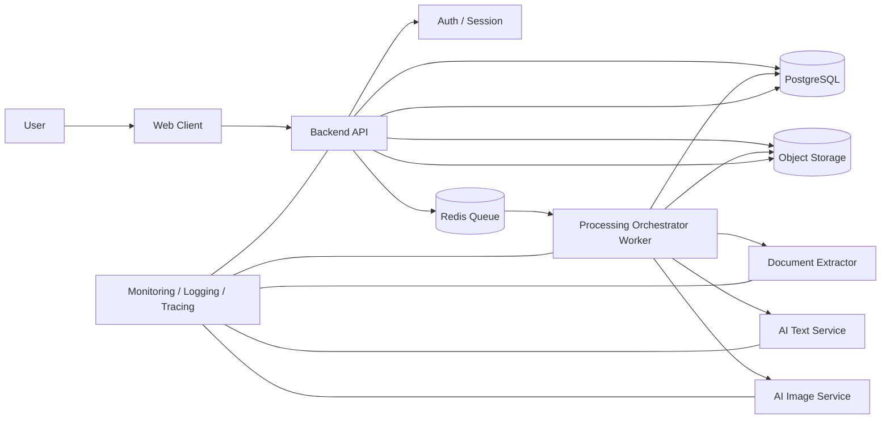
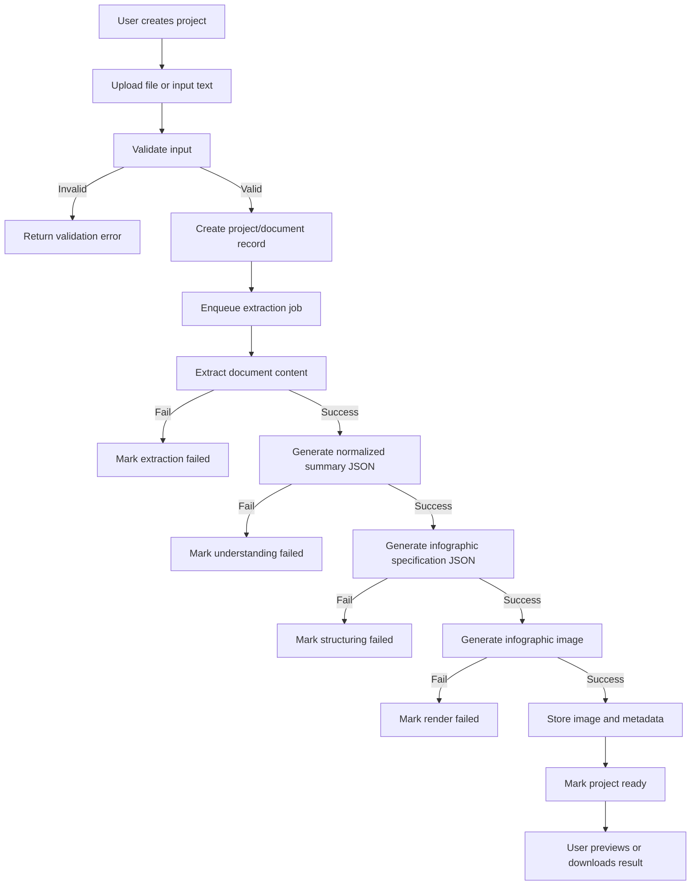
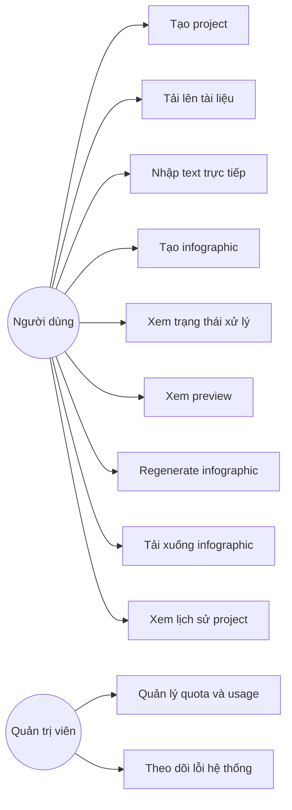
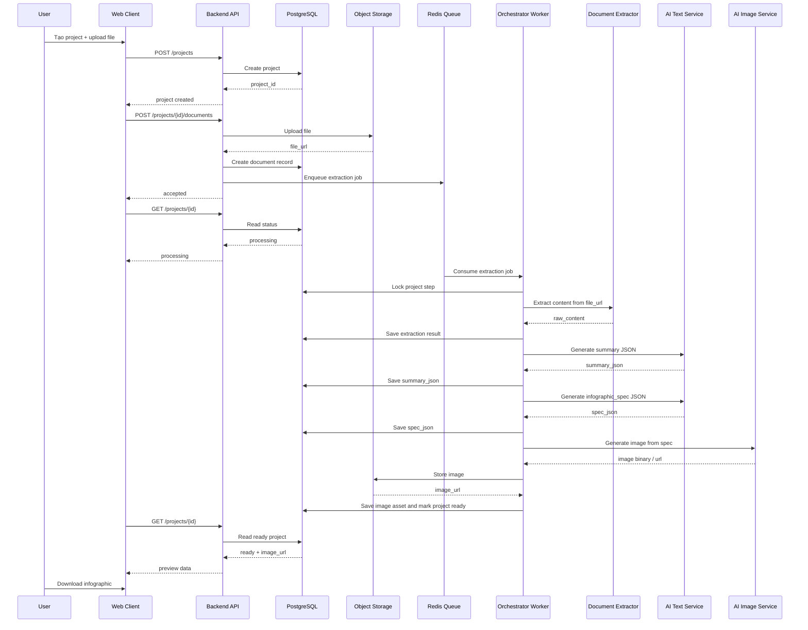
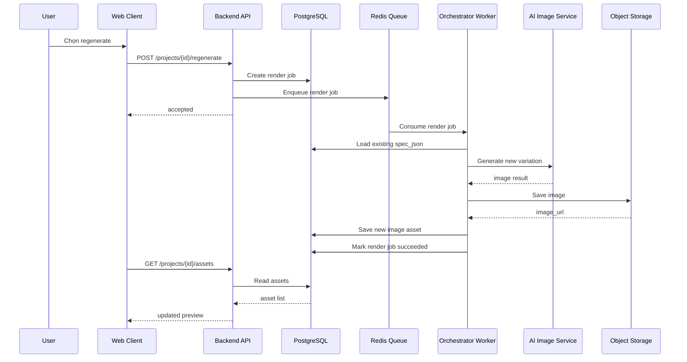
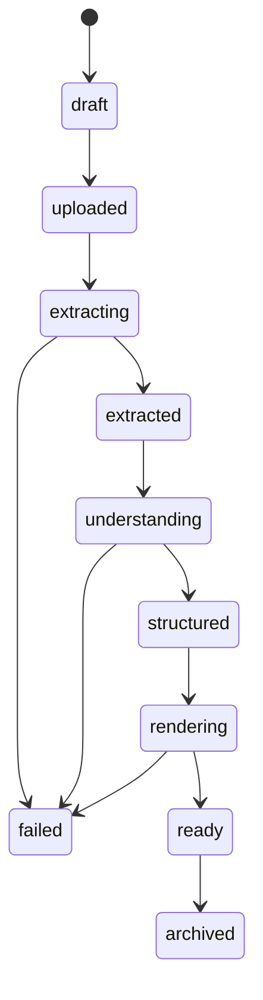
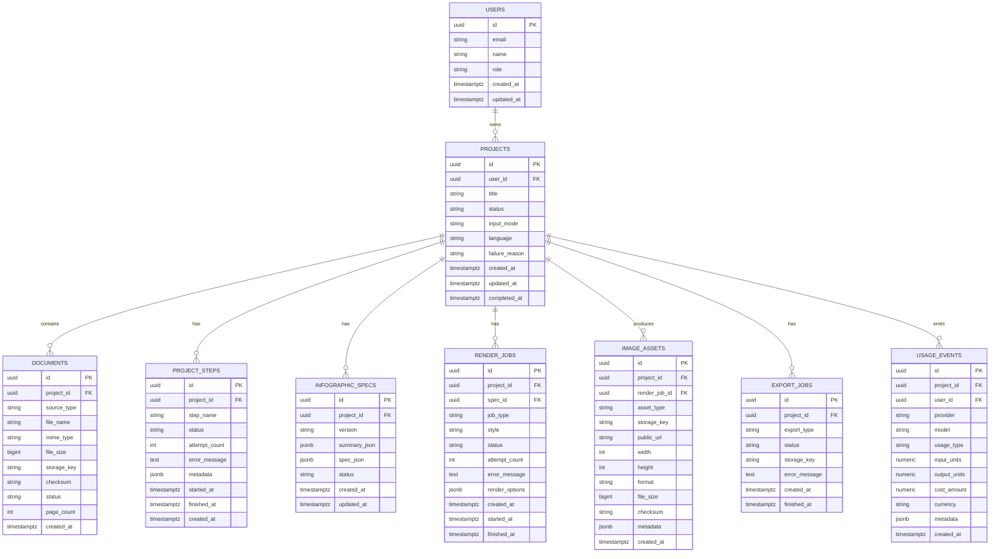
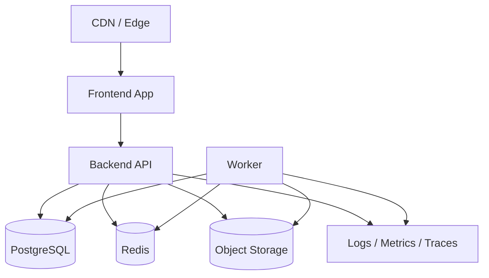

# 6. System Design

## 6.1. Giới thiệu

Tài liệu này mô tả thiết kế hệ thống ở mức chi tiết cho nền tảng AI Infographic Generator. Mục tiêu của hệ thống là cho phép người dùng tải lên tài liệu hoặc nhập dữ liệu, sau đó hệ thống tự động phân tích nội dung, tổ chức lại thông tin và tạo ra infographic hoàn chỉnh.

Tài liệu này tập trung vào thiết kế hệ thống ở góc độ kiến trúc, luồng xử lý, dữ liệu, API, khả năng mở rộng, bảo mật, giám sát vận hành và các quyết định kỹ thuật quan trọng.

## 6.2. Mục tiêu thiết kế

Hệ thống cần đạt được các mục tiêu sau:

- Có khả năng xử lý end-to-end từ đầu vào là tài liệu hoặc dữ liệu thô đến đầu ra là infographic có thể xem trước và tải xuống
- Kiến trúc đủ linh hoạt để tách riêng từng bước xử lý, tránh phụ thuộc hoàn toàn vào một lời gọi AI duy nhất
- Phù hợp với giai đoạn MVP nhưng đồng thời có nền tảng để mở rộng lên production
- Có khả năng quan sát và kiểm soát tốt, bao gồm theo dõi thời gian xử lý, trạng thái job, số lần retry và chi phí

## 6.3. Phạm vi của tài liệu thiết kế

Tài liệu này bao gồm:

- Kiến trúc tổng thể của hệ thống
- Luồng dữ liệu và luồng xử lý
- Các thành phần chính của hệ thống
- Thiết kế service và module
- Thiết kế database
- Thiết kế API
- Thiết kế job queue và xử lý bất đồng bộ
- Thiết kế sequence diagram cho các luồng chính
- Thiết kế cơ chế retry, idempotency và error handling
- Thiết kế bảo mật, logging, monitoring, scaling
- Các trade-off kỹ thuật và định hướng mở rộng

## 6.4. Kiến trúc tổng thể

Hệ thống được thiết kế theo mô hình nhiều lớp, trong đó phần xử lý nội dung được chia thành các giai đoạn rõ ràng:

1. Ingestion Layer  
2. Extraction Layer  
3. Understanding Layer  
4. Structuring Layer  
5. Visualization Layer  
6. Delivery Layer  

Kiến trúc được chia thành các thành phần sau:

- Web Client
- Backend API
- Auth Service
- File Storage
- Processing Orchestrator
- Document Extractor
- AI Text Service
- AI Image Service
- Queue / Worker
- PostgreSQL
- Redis
- Observability Stack

## 6.5. Sơ đồ kiến trúc tổng thể



## 6.6. Lý do chọn kiến trúc nhiều bước

Hệ thống không chọn hướng “một prompt tạo ra tất cả”, mà tách pipeline thành nhiều bước trung gian có trạng thái rõ ràng. Điều này mang lại các lợi ích:

- Có thể kiểm tra kết quả từng bước
- Có thể cache kết quả trung gian
- Có thể retry từng bước nếu thất bại
- Có thể thay model riêng cho từng tác vụ
- Có thể kiểm soát chi phí chi tiết theo bước
- Có thể cho người dùng chỉnh sửa ở bước spec thay vì phải tạo lại toàn bộ

## 6.7. Các thành phần chính

### 6.7.1. Web Client

Web Client là giao diện người dùng, chịu trách nhiệm upload file hoặc nhập text, tạo project mới, hiển thị trạng thái xử lý, hiển thị preview infographic, cho phép regenerate, tải xuống kết quả và hỗ trợ chỉnh sửa ở các phiên bản sau.

### 6.7.2. Backend API

Backend API là lớp trung tâm, chịu trách nhiệm xác thực người dùng, quản lý project, document, render job, cung cấp API cho frontend, gửi job vào queue, truy vấn trạng thái job và kiểm soát quyền truy cập tài nguyên.

### 6.7.3. Object Storage

Object Storage được dùng để lưu file người dùng upload, nội dung extract tạm thời, ảnh infographic đầu ra, file export và thumbnail.

### 6.7.4. PostgreSQL

PostgreSQL là nguồn dữ liệu chính, lưu user, project, document, extracted content metadata, summary JSON, infographic specification JSON, render job, image asset, export task, usage và billing event.

### 6.7.5. Redis

Redis được dùng cho hai mục tiêu: queue / job broker và cache kết quả trung gian hoặc trạng thái ngắn hạn.

### 6.7.6. Processing Orchestrator

Đây là worker trung tâm điều phối pipeline, có nhiệm vụ nhận job từ queue, kiểm tra trạng thái project, gọi các module xử lý theo thứ tự, cập nhật trạng thái vào DB, retry có kiểm soát nếu bước nào đó lỗi và phát sinh event phục vụ analytics và billing.

### 6.7.7. Document Extractor

Module này chịu trách nhiệm chuyển file đầu vào thành nội dung có thể xử lý tiếp như PDF sang text và metadata, DOCX sang paragraphs và headings, CSV/XLSX sang bảng dữ liệu.

### 6.7.8. AI Text Service

Module này chịu trách nhiệm cho các tác vụ text như tóm tắt nội dung, trích xuất insight, chuẩn hóa dữ liệu, sinh infographic specification, gợi ý title, section và narrative flow.

### 6.7.9. AI Image Service

Module này chịu trách nhiệm nhận infographic specification, chuyển thành prompt ảnh, gọi model tạo ảnh, kiểm tra tính hợp lệ của output, lưu ảnh ra storage và trả về URL cùng metadata.

### 6.7.10. Monitoring / Logging / Tracing

Hệ thống cần có observability đầy đủ, bao gồm logging tập trung, distributed tracing, metrics theo service, alerting và dashboard vận hành.

## 6.8. Luồng nghiệp vụ chính

Hệ thống có bốn luồng nghiệp vụ cốt lõi:

1. Tạo project mới và upload tài liệu  
2. Xử lý tài liệu để sinh infographic  
3. Regenerate infographic  
4. Export và download  

## 6.9. Flowchart tổng quát của pipeline



## 6.10. Use Case Diagram



## 6.11. Sequence Diagram cho luồng tạo infographic



## 6.12. Sequence Diagram cho regenerate



## 6.13. Bounded Contexts

Để hệ thống dễ quản lý, logic nghiệp vụ có thể chia thành các bounded context sau:

- Project Management Context
- Document Processing Context
- Content Intelligence Context
- Rendering Context
- Usage & Billing Context
- Observability Context

## 6.14. Trạng thái project và state machine

Các trạng thái đề xuất:

- draft
- uploaded
- extracting
- extracted
- understanding
- structured
- rendering
- ready
- failed
- archived



## 6.15. Database Design

### 6.15.1. Nguyên tắc thiết kế dữ liệu

Database cần hỗ trợ các yêu cầu sau:

- Dễ truy vấn project và trạng thái hiện tại
- Dễ kiểm tra toàn bộ pipeline history của một project
- Hỗ trợ regenerate nhiều lần
- Hỗ trợ audit và troubleshooting
- Hỗ trợ thống kê usage
- Không lưu file nhị phân lớn trong DB

### 6.15.2. ER Diagram



### 6.15.3. Mô tả các bảng quan trọng

- **USERS:** Lưu thông tin người dùng và vai trò  
- **PROJECTS:** Thực thể trung tâm của toàn bộ nghiệp vụ  
- **DOCUMENTS:** Lưu metadata của tài liệu người dùng upload  
- **PROJECT_STEPS:** Lưu lịch sử từng bước của pipeline  
- **INFOGRAPHIC_SPECS:** Lưu summary JSON và spec JSON  
- **RENDER_JOBS:** Mỗi lần tạo ảnh hoặc regenerate sẽ tạo một job riêng  
- **IMAGE_ASSETS:** Lưu đầu ra ảnh, thumbnail và metadata  
- **USAGE_EVENTS:** Lưu usage phục vụ billing, cost analysis và observability  

## 6.16. Data Contracts

### 6.16.1. summary_json

```json
{
  "document_title": "Báo cáo tăng trưởng thị trường",
  "language": "vi",
  "audience": "marketer",
  "main_topic": "Tăng trưởng thương mại điện tử",
  "key_points": [
    "Số lượng đơn hàng tăng 25% trong quý 1",
    "Kênh mobile chiếm 62% lưu lượng truy cập",
    "Tỷ lệ chuyển đổi tăng mạnh ở nhóm khách hàng quay lại"
  ],
  "statistics": [
    {
      "label": "Tăng trưởng đơn hàng",
      "value": "25%",
      "period": "Q1"
    }
  ],
  "entities": [
    "mobile",
    "khách hàng quay lại",
    "thương mại điện tử"
  ],
  "tone": "professional",
  "warnings": []
}
```

### 6.16.2. spec_json

```json
{
  "title": "Tăng trưởng thương mại điện tử quý 1",
  "subtitle": "Các chỉ số nổi bật từ báo cáo mới nhất",
  "canvas_ratio": "4:5",
  "theme": "modern",
  "palette": {
    "primary": "#2563eb",
    "secondary": "#0f172a",
    "accent": "#f59e0b",
    "background": "#f8fafc"
  },
  "sections": [
    {
      "type": "headline_metric",
      "title": "Đơn hàng tăng",
      "content": "25%",
      "visual_hint": "large number"
    },
    {
      "type": "insight_list",
      "title": "Các điểm nổi bật",
      "items": [
        "Mobile chiếm 62% lưu lượng",
        "Khách hàng quay lại có tỷ lệ chuyển đổi cao hơn",
        "Chiến dịch theo hành vi cho hiệu quả tốt"
      ]
    }
  ],
  "visual_elements": [
    "bar chart",
    "icon set",
    "highlight cards"
  ],
  "image_prompt": "Create a modern Vietnamese business infographic...",
  "negative_prompt": "misspelled text, clutter, distorted layout"
}
```

## 6.17. API Design

### 6.17.1. Nguyên tắc API

API cần tuân theo các nguyên tắc sau:

- RESTful ở lớp public API
- Bất đồng bộ cho các tác vụ nặng
- Trả về trạng thái rõ ràng
- Có idempotency cho các thao tác tạo job
- Có pagination cho danh sách project và asset
- Có versioning từ đầu

### 6.17.2. Danh sách API chính

#### Tạo project
`POST /api/v1/projects`

Request:
```json
{
  "title": "Infographic báo cáo quý 1",
  "input_mode": "file"
}
```

Response:
```json
{
  "id": "project_uuid",
  "status": "draft",
  "created_at": "2026-03-20T10:00:00Z"
}
```

#### Upload document
`POST /api/v1/projects/{projectId}/documents`

Response:
```json
{
  "document_id": "doc_uuid",
  "status": "uploaded"
}
```

#### Nhập text trực tiếp
`POST /api/v1/projects/{projectId}/text`

Request:
```json
{
  "content": "Nội dung văn bản cần tạo infographic",
  "language": "vi"
}
```

Response:
```json
{
  "project_id": "project_uuid",
  "status": "uploaded"
}
```

#### Bắt đầu pipeline tạo infographic
`POST /api/v1/projects/{projectId}/generate`

Request:
```json
{
  "theme": "modern",
  "canvas_ratio": "4:5",
  "mode": "safe"
}
```

Response:
```json
{
  "project_id": "project_uuid",
  "status": "extracting",
  "job_id": "job_uuid"
}
```

#### Lấy chi tiết project
`GET /api/v1/projects/{projectId}`

Response:
```json
{
  "id": "project_uuid",
  "title": "Infographic báo cáo quý 1",
  "status": "ready",
  "current_step": "completed",
  "summary": {},
  "latest_spec": {},
  "latest_asset": {
    "id": "asset_uuid",
    "url": "https://cdn.example.com/asset.png"
  }
}
```

#### Lấy danh sách asset
`GET /api/v1/projects/{projectId}/assets`

#### Regenerate
`POST /api/v1/projects/{projectId}/regenerate`

Request:
```json
{
  "style": "minimal",
  "variation_count": 1
}
```

#### Export
`POST /api/v1/projects/{projectId}/exports`

Request:
```json
{
  "export_type": "png"
}
```

#### Lấy lịch sử project của user
`GET /api/v1/projects`

### 6.17.3. Response envelope chuẩn

```json
{
  "data": {},
  "error": null,
  "meta": {}
}
```

Khi lỗi:

```json
{
  "data": null,
  "error": {
    "code": "INVALID_FILE_TYPE",
    "message": "Định dạng file không được hỗ trợ"
  },
  "meta": {}
}
```

## 6.18. Xử lý bất đồng bộ và queue design

### 6.18.1. Các loại job

- document.extract
- content.summarize
- content.structure
- image.render
- image.regenerate
- asset.export

### 6.18.2. Luồng job

1. API tạo project và enqueue generate job  
2. Worker lấy job và chạy extraction  
3. Nếu extraction thành công, worker tạo summarize job  
4. Sau summarize là structure  
5. Sau structure là render  
6. Sau render là ready  

### 6.18.3. Retry policy

Mỗi bước nên có retry policy riêng:

- Extraction: retry 2 lần
- AI text generation: retry 2 lần
- Image generation: retry 1 lần
- Export: retry 2 lần

### 6.18.4. Dead-letter queue

Các job vượt quá số lần retry cần được chuyển vào dead-letter queue hoặc đánh dấu failed trong DB để phục vụ điều tra.

## 6.19. Idempotency và concurrency control

### 6.19.1. Idempotency

Các endpoint tạo job như `/generate` và `/regenerate` cần hỗ trợ idempotency key để tránh bấm nhiều lần tạo nhiều job trùng.

### 6.19.2. Optimistic locking / row locking

Khi worker xử lý project, cần tránh hai worker cùng xử lý cùng một bước. Có thể dùng `SELECT ... FOR UPDATE` hoặc update kèm điều kiện trạng thái cũ.

### 6.19.3. Duplicate prevention

Nếu một project đã ở trạng thái `rendering`, không nên cho tạo thêm một generate job mới cùng loại.

## 6.20. Validation và quality gates

### 6.20.1. Validation đầu vào

Trước khi xử lý, cần kiểm tra:

- File type có được hỗ trợ không
- File size có vượt giới hạn không
- Nội dung text có rỗng không
- Encoding có hợp lệ không

### 6.20.2. Validation summary_json

Cần validate:

- Có title hoặc main topic
- Có ít nhất một key point
- Ngôn ngữ phải hợp lệ
- Cấu trúc đúng schema

### 6.20.3. Validation spec_json

Cần validate:

- Có title
- Có sections
- Theme hợp lệ
- Canvas ratio hợp lệ
- Không có quá nhiều section gây layout quá tải

### 6.20.4. Validation ảnh đầu ra

Cần kiểm tra:

- File có tồn tại và đọc được
- Kích thước đúng kỳ vọng
- Định dạng đúng
- Không phải file hỏng
- Metadata được ghi nhận đầy đủ

## 6.21. Chế độ render: Fast mode và Safe mode

Hệ thống nên hỗ trợ hai chế độ:

- **Fast mode:** Model ảnh tạo luôn infographic có text  
- **Safe mode:** Model ảnh tạo background hoặc layout, sau đó hệ thống render text riêng  

## 6.22. Text rendering strategy trong Safe mode

Với Safe mode, nên có thêm một rendering layer phía server hoặc frontend để overlay text:

- Dùng SVG nếu cần chất lượng cao, dễ scale
- Dùng HTML/CSS nếu cần preview nhanh
- Dùng canvas nếu cần export thành ảnh cuối

## 6.23. Cơ chế export

Export không nên luôn làm đồng bộ trong request nếu quá nặng. Luồng export gồm:

1. User chọn export  
2. API tạo export job  
3. Worker dựng file export  
4. Lưu ra storage  
5. Trả về download URL  

## 6.24. Bảo mật hệ thống

### 6.24.1. Authentication

Có thể dùng session hoặc JWT. Với web app hiện đại, có thể dùng cookie-based session để đơn giản hóa CSRF protection và UX.

### 6.24.2. Authorization

Mọi project, document, asset phải kiểm tra ownership. Người dùng chỉ được thao tác trên tài nguyên của mình.

### 6.24.3. File upload security

Cần kiểm tra:

- MIME type
- Magic bytes
- Giới hạn kích thước
- Virus scanning nếu cần
- Không cho phép thực thi file

### 6.24.4. Secret management

API keys cho AI provider, storage, DB phải được lưu trong secret manager hoặc environment variables bảo vệ đúng chuẩn.

### 6.24.5. Rate limiting

Rate limit theo user, IP, endpoint nhạy cảm và các endpoint generate / regenerate / export.

### 6.24.6. Audit trail

Các hành động quan trọng nên được audit như tạo project, upload file, generate, regenerate, export và delete.

## 6.25. Logging, Monitoring, Tracing

### 6.25.1. Logging

Mỗi request và mỗi job cần có correlation id hoặc trace id. Log phải có cấu trúc JSON để dễ truy vấn.

### 6.25.2. Metrics

Các metric quan trọng:

- request count
- error rate
- p50 / p95 / p99 latency
- queue depth
- job success ratio
- token usage
- image render cost
- average project completion time

### 6.25.3. Tracing

Tracing cần bao phủ frontend request đến backend API, backend đến worker, worker đến AI provider, storage và DB.

## 6.26. Chiến lược scaling

### 6.26.1. Horizontal scaling

Các thành phần dễ scale ngang gồm Backend API, Worker, Frontend và Redis consumer.

### 6.26.2. Queue-based decoupling

Việc đưa các bước nặng vào queue giúp Backend API phản hồi nhanh, worker scale độc lập và hệ thống chịu tải tốt hơn.

### 6.26.3. Caching

Có thể cache:

- File checksum → extraction result
- Summary JSON theo checksum
- Spec JSON theo summary signature
- Public asset metadata

### 6.26.4. Storage lifecycle

Ảnh và export cũ có thể áp dụng retention policy để giảm chi phí lưu trữ.

## 6.27. Hiệu năng và SLA nội bộ

Một số mục tiêu nội bộ:

- Tạo project nhỏ hơn 500ms
- Upload metadata response nhỏ hơn 1s
- Poll trạng thái nhỏ hơn 300ms
- End-to-end generate từ 5–20s tùy input
- Regenerate từ 5–15s
- Export từ 2–10s

## 6.28. Khả năng chịu lỗi

### 6.28.1. Phân loại lỗi

- User input error
- System internal error
- Upstream provider error
- Data validation error
- Timeout / rate limit
- Partial success error

### 6.28.2. Fallback strategy

Ví dụ:

- Nếu image generation lỗi ở Fast mode, có thể fallback sang Safe mode
- Nếu summary_json invalid, có thể gọi repair pass một lần
- Nếu export PDF lỗi, vẫn giữ PNG available

### 6.28.3. Graceful degradation

Nếu upstream AI chậm, hệ thống vẫn cần giữ trạng thái processing, hiển thị progress hợp lý và không làm crash UI.

## 6.29. Deployment topology



## 6.30. Quy ước đặt tên job và event

### Job names
- `project.generate`
- `document.extract`
- `content.summarize`
- `content.structure`
- `image.render`
- `image.regenerate`
- `asset.export`

### Event names
- `project.created`
- `document.uploaded`
- `document.extracted`
- `summary.generated`
- `spec.generated`
- `image.rendered`
- `project.failed`
- `export.completed`

## 6.31. Open questions và quyết định cần chốt

Một số quyết định nên được chốt sớm:

1. Chế độ mặc định là Fast mode hay Safe mode  
2. Có cho phép edit spec trước khi render hay không  
3. Regenerate theo style hay theo toàn bộ layout  
4. Export PDF có thuộc MVP hay không  
5. Có giới hạn số lần regenerate miễn phí hay không  
6. Có lưu toàn bộ raw extracted text hay chỉ lưu bản rút gọn  
7. Có cần versioning cho spec JSON ngay từ MVP hay không  

## 6.32. Đề xuất lộ trình triển khai kỹ thuật

### Giai đoạn 1: MVP nền tảng
- Tạo project
- Upload file / nhập text
- Extraction
- Summary JSON
- Spec JSON
- Render ảnh
- Preview và download

### Giai đoạn 2: Production hardening
- Retry policy
- Idempotency
- Usage tracking
- Better observability
- Export pipeline
- Quota / billing basics

### Giai đoạn 3: Advanced editing
- Edit spec
- Safe text overlay
- Version history
- Multiple outputs
- Collaboration

## 6.33. Kết luận

Thiết kế hệ thống này ưu tiên tính ổn định, khả năng kiểm soát và khả năng mở rộng hơn là tối giản ngắn hạn. Quyết định quan trọng nhất là tách pipeline thành các bước có dữ liệu trung gian rõ ràng, thay vì giao toàn bộ bài toán cho một lần gọi AI.

Nhờ lớp trung gian `summary_json` và `spec_json`, hệ thống có được những lợi thế sau:

- Kiểm soát chất lượng tốt hơn
- Dễ debug hơn
- Hỗ trợ regenerate tốt hơn
- Dễ fallback giữa nhiều cách render
- Dễ tối ưu chi phí
- Dễ thay đổi model AI trong tương lai