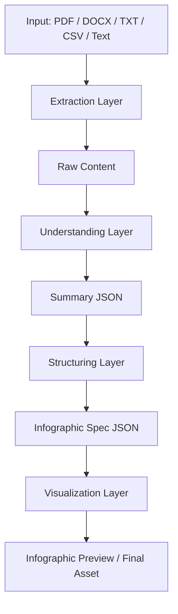
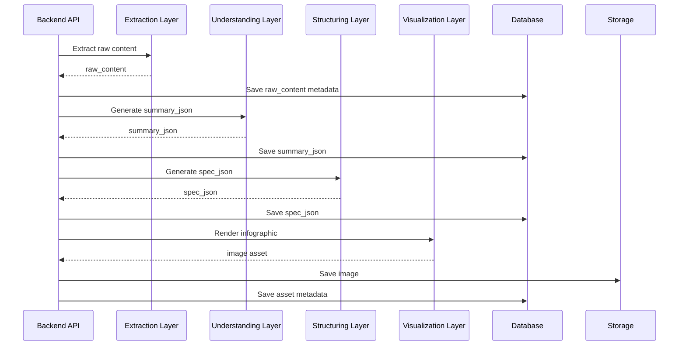

# Tài liệu thiết kế AI Pipeline
## Dự án: AI Infographic Generator

---

## 1. Mục đích tài liệu

Tài liệu này mô tả chi tiết thiết kế của AI pipeline trong hệ thống AI Infographic Generator. Mục tiêu của tài liệu là làm rõ cách hệ thống sử dụng AI để chuyển đổi dữ liệu đầu vào thành infographic, cách phân tách các bước xử lý, dữ liệu đi qua từng bước, tiêu chí đánh giá chất lượng, cơ chế xử lý lỗi, chiến lược tối ưu chi phí và các quyết định kiến trúc liên quan đến AI.

Nếu tài liệu System Design mô tả toàn bộ kiến trúc hệ thống, thì tài liệu này chỉ tập trung vào phần “AI intelligence flow” – tức là cách AI tham gia vào chuỗi xử lý nội dung từ lúc tiếp nhận tài liệu đến khi tạo ra kết quả trực quan cuối cùng.

Tài liệu này đặc biệt quan trọng vì trong một sản phẩm AI, phần khó nhất không phải là gọi API model, mà là thiết kế được một pipeline đủ ổn định, có thể kiểm soát chất lượng, dễ mở rộng và vận hành được trong thực tế.

---

## 2. Vai trò của AI trong hệ thống

Trong dự án AI Infographic Generator, AI không chỉ được dùng để tạo ảnh. AI thực hiện ba vai trò khác nhau trong pipeline.

Thứ nhất, AI đóng vai trò như một công cụ đọc hiểu tài liệu. Ở vai trò này, AI tiếp nhận nội dung đầu vào, phân tích ngữ nghĩa, xác định các ý chính, nhận diện dữ liệu quan trọng, tách các thực thể và hiểu ngữ cảnh tổng thể.

Thứ hai, AI đóng vai trò như một biên tập viên nội dung. Sau khi hiểu tài liệu, AI cần tổ chức lại thông tin theo cấu trúc phù hợp với infographic. Công việc này không còn là tóm tắt đơn thuần, mà là tái cấu trúc nội dung theo góc nhìn trực quan hóa.

Thứ ba, AI đóng vai trò như một nhà thiết kế hoặc bộ máy hỗ trợ render. Dựa trên cấu trúc nội dung đã được chuẩn hóa, AI có thể tạo ra infographic hoàn chỉnh hoặc tạo các thành phần hình ảnh phục vụ cho việc render cuối cùng.

Việc phân biệt rõ ba vai trò này là nền tảng để thiết kế pipeline ổn định. Nếu không tách riêng các vai trò, hệ thống sẽ trở nên khó kiểm soát vì một model hoặc một prompt phải cùng lúc vừa hiểu nội dung, vừa tổ chức lại cấu trúc, vừa render ảnh.

---

## 3. Mục tiêu thiết kế AI Pipeline

AI pipeline của hệ thống cần đạt được các mục tiêu sau:

- Chuyển đổi dữ liệu đầu vào thành kết quả infographic theo cách có thể lặp lại và kiểm soát được
- Tách biệt các bước xử lý để dễ kiểm tra chất lượng từng bước
- Giảm phụ thuộc vào một lần gọi model duy nhất
- Cho phép validate dữ liệu trung gian trước khi chuyển sang bước tiếp theo
- Hỗ trợ retry, repair và fallback khi kết quả AI không đạt yêu cầu
- Tối ưu chi phí bằng cách dùng đúng loại model cho đúng tác vụ
- Hỗ trợ mở rộng trong tương lai sang các output khác như slide, mindmap, dashboard

---

## 4. Nguyên tắc thiết kế pipeline

AI pipeline trong dự án này được xây dựng dựa trên các nguyên tắc sau.

### 4.1. Tách nhỏ theo chức năng nhận thức

Mỗi bước AI chỉ nên giải quyết một nhóm nhiệm vụ rõ ràng. Ví dụ, bước đọc hiểu tài liệu chỉ tập trung vào việc hiểu nội dung, không đồng thời tạo ảnh. Bước tổ chức cấu trúc chỉ tập trung vào việc chuyển nội dung thành specification, không cố gắng tạo luôn output cuối cùng.

### 4.2. Luôn có dữ liệu trung gian có cấu trúc

Kết quả của mỗi bước AI nên được chuẩn hóa thành dữ liệu có schema rõ ràng. Điều này giúp hệ thống dễ validate, dễ debug, dễ lưu trữ và dễ tái sử dụng.

### 4.3. Kiểm soát chất lượng ở từng lớp

Chất lượng không được đánh giá chỉ ở bước cuối. Mỗi lớp của pipeline phải có quality gate riêng. Nếu dữ liệu trung gian không đạt chuẩn, pipeline nên dừng hoặc retry thay vì đẩy lỗi sang bước sau.

### 4.4. Ưu tiên deterministic output khi có thể

Khi tác vụ là trích xuất dữ liệu hoặc sinh cấu trúc, AI nên được cấu hình theo hướng nhất quán, ít sáng tạo hơn. Tính sáng tạo chỉ nên tăng ở các bước cần tạo variation hoặc phong cách hình ảnh.

### 4.5. Phân tách “hiểu nội dung” và “trình bày nội dung”

Đây là nguyên tắc quan trọng nhất. Một hệ thống tốt phải hiểu đúng trước, rồi mới trình bày đẹp. Nếu hai bước này bị trộn lẫn, output thường đẹp nhưng sai, hoặc đúng nhưng rối.

---

## 5. Phạm vi của AI Pipeline

AI pipeline trong giai đoạn đầu sẽ xử lý các đầu vào sau:

- PDF
- DOCX hoặc nội dung văn bản
- TXT
- CSV hoặc dữ liệu bảng đơn giản
- Nội dung text nhập trực tiếp

Trong giai đoạn MVP, pipeline tập trung tạo ra một infographic tĩnh. Những đầu ra phức tạp hơn như infographic đa trang, animated infographic hoặc editable design layer sẽ được xem xét ở giai đoạn sau.

---

## 6. Tổng quan pipeline nhiều bước

Pipeline được chia thành 5 lớp chính:

1. Ingestion Layer  
2. Extraction Layer  
3. Understanding Layer  
4. Structuring Layer  
5. Visualization Layer  

Trong đó, AI tham gia trực tiếp ở Understanding Layer, Structuring Layer và có thể tham gia ở Visualization Layer.

---

## 7. Sơ đồ AI Pipeline tổng quát



---

## 8. Mô tả chi tiết từng lớp

## 8.1. Ingestion Layer

Đây là lớp tiếp nhận dữ liệu đầu vào. Lớp này chưa dùng AI mà chủ yếu đảm bảo dữ liệu đi vào hệ thống đúng định dạng và đủ điều kiện để xử lý.

Các nhiệm vụ chính:

- Nhận file hoặc text từ người dùng
- Kiểm tra định dạng
- Kiểm tra kích thước
- Gắn metadata ban đầu
- Tạo project và document record

Đầu ra của lớp này là một input hợp lệ và có thể được đưa vào bước extraction.

---

## 8.2. Extraction Layer

Lớp này chịu trách nhiệm chuyển file đầu vào thành raw content. Ở bước này, hệ thống ưu tiên dùng các công cụ deterministic hoặc parser chuyên biệt trước khi dùng AI.

Ví dụ:

- PDF → text theo page hoặc section
- DOCX → paragraph, heading, table
- CSV → rows, columns, statistics cơ bản
- TXT → raw text
- Text input → normalized text

Extraction Layer nên cố gắng giữ lại càng nhiều cấu trúc gốc càng tốt, ví dụ tiêu đề, heading, danh sách, bảng, số liệu, thay vì chỉ ghép toàn bộ thành một khối text phẳng.

Đầu ra của bước này là `raw_content`, thường bao gồm:

- raw_text
- document_structure
- metadata
- source_type
- page_count hoặc section count

---

## 8.3. Understanding Layer

Đây là lớp AI đầu tiên và là lớp có nhiệm vụ “đọc hiểu”. Mục tiêu của lớp này là biến raw content thành một representation có cấu trúc, phản ánh nội dung cốt lõi của tài liệu.

Các nhiệm vụ chính của lớp này gồm:

- Xác định chủ đề chính
- Tóm tắt nội dung
- Trích xuất key points
- Trích xuất số liệu hoặc statistics
- Xác định entities
- Nhận diện tone hoặc audience
- Cảnh báo nội dung mơ hồ hoặc thiếu dữ liệu

Đầu ra của bước này là `summary_json`.

Đây là bước cực kỳ quan trọng vì nếu summary sai, toàn bộ pipeline phía sau sẽ tạo ra infographic sai lệch.

---

## 8.4. Structuring Layer

Sau khi đã có summary JSON, hệ thống cần chuyển dữ liệu này thành một cấu trúc phù hợp cho infographic.

Các nhiệm vụ chính của lớp này gồm:

- Chọn narrative flow phù hợp
- Chia nội dung thành section
- Sinh title và subtitle
- Chọn loại biểu diễn như metric card, timeline, bullet list, chart hint
- Xác định hierarchy
- Gắn theme hoặc layout hint
- Sinh prompt hoặc design instruction cho bước render

Đầu ra của bước này là `spec_json`.

Spec JSON không phải là ảnh. Nó là “bản thiết kế nội dung” của infographic.

---

## 8.5. Visualization Layer

Lớp này biến spec JSON thành output trực quan cuối cùng. Có hai chiến lược chính.

### Fast Mode
AI image model tạo ra infographic gần như hoàn chỉnh, bao gồm cả text.

### Safe Mode
AI chỉ tạo background, composition hoặc visual style, trong khi text được render riêng bởi hệ thống.

Fast Mode cho tốc độ nhanh hơn nhưng rủi ro sai chữ cao hơn. Safe Mode ổn định hơn, đặc biệt với tiếng Việt.

Đầu ra cuối cùng là:

- preview image
- final image
- asset metadata
- variation history

---

## 9. Thiết kế dữ liệu trung gian

Một AI pipeline tốt không chỉ cần prompt tốt mà còn cần dữ liệu trung gian tốt. Trong hệ thống này, hai lớp dữ liệu trung gian quan trọng nhất là `summary_json` và `spec_json`.

## 9.1. summary_json

summary_json là kết quả của Understanding Layer. Mục tiêu của summary_json là trả lời câu hỏi: “Tài liệu này thực sự nói về điều gì?”

Một ví dụ cấu trúc:

```json
{
  "document_title": "Báo cáo tăng trưởng thương mại điện tử",
  "language": "vi",
  "main_topic": "Tăng trưởng thương mại điện tử quý 1",
  "audience": "marketer",
  "key_points": [
    "Đơn hàng tăng 25%",
    "Mobile chiếm 62% lượng truy cập",
    "Khách hàng quay lại có tỷ lệ chuyển đổi cao hơn"
  ],
  "statistics": [
    {
      "label": "Tăng trưởng đơn hàng",
      "value": "25%",
      "period": "Q1"
    }
  ],
  "entities": [
    "mobile",
    "khách hàng quay lại",
    "thương mại điện tử"
  ],
  "tone": "professional",
  "warnings": []
}
```

summary_json cần có tính khái quát tốt, nhưng không nên quá dài hoặc nhồi nhiều chi tiết không cần thiết.

---

## 9.2. spec_json

spec_json là kết quả của Structuring Layer. Mục tiêu của spec_json là trả lời câu hỏi: “Nếu dùng tài liệu này để tạo infographic, cần trình bày như thế nào?”

Một ví dụ cấu trúc:

```json
{
  "title": "Tăng trưởng thương mại điện tử quý 1",
  "subtitle": "Các chỉ số nổi bật từ báo cáo mới nhất",
  "canvas_ratio": "4:5",
  "theme": "modern",
  "sections": [
    {
      "type": "headline_metric",
      "title": "Đơn hàng tăng",
      "content": "25%"
    },
    {
      "type": "insight_list",
      "title": "Điểm nổi bật",
      "items": [
        "Mobile chiếm 62% lượng truy cập",
        "Khách hàng quay lại chuyển đổi tốt hơn",
        "Hành vi mua sắm thay đổi theo khung giờ"
      ]
    }
  ],
  "visual_elements": [
    "metric card",
    "bar chart hint",
    "icon set"
  ],
  "layout_hint": "top-down hierarchy",
  "image_prompt": "Create a modern infographic layout...",
  "negative_prompt": "misspelled text, cluttered layout"
}
```

spec_json cần cân bằng giữa hai yếu tố: đủ chi tiết để render đúng, nhưng không quá cứng nhắc đến mức khó tạo variation.

---

## 10. Thiết kế model selection strategy

Không nên dùng cùng một loại model cho mọi bước. Chiến lược chọn model nên dựa trên bản chất của từng tác vụ.

### 10.1. Model cho Understanding Layer

Bước này cần:

- hiểu ngữ nghĩa tốt
- trích xuất dữ liệu ổn định
- structured output
- chi phí hợp lý

Do đó, nên dùng model text thiên về structured reasoning, không cần quá mạnh về sáng tạo.

### 10.2. Model cho Structuring Layer

Bước này cần:

- hiểu summary
- tổ chức logic nội dung
- sinh cấu trúc nhất quán
- tạo title, section, layout hint

Model ở bước này cần cân bằng giữa tính logic và khả năng viết nội dung ngắn gọn, dễ trình bày.

### 10.3. Model cho Visualization Layer

Bước này cần:

- tạo ảnh
- giữ đúng structure
- hỗ trợ text rendering hoặc ít nhất không phá vỡ bố cục
- có thể tạo nhiều variation

Trong một số trường hợp, Visualization Layer không chỉ gồm image model mà còn gồm thêm render engine phía hệ thống.

---

## 11. Lý do tách Understanding và Structuring thành hai bước

Nhiều đội ngũ mới làm AI product thường muốn tiết kiệm thời gian bằng cách cho model đọc tài liệu và tạo luôn infographic prompt hoặc output cuối. Cách làm này nhìn có vẻ nhanh, nhưng thường có ba vấn đề lớn.

Thứ nhất, rất khó debug. Khi output sai, không biết lỗi đến từ việc model hiểu sai tài liệu hay do nó tổ chức layout chưa tốt.

Thứ hai, rất khó validate. Vì không có dữ liệu trung gian, hệ thống không thể kiểm tra xem AI đã hiểu đúng nội dung trước khi render hay chưa.

Thứ ba, rất khó tái sử dụng. Nếu muốn regenerate hoặc đổi style, hệ thống lại phải chạy lại từ đầu.

Tách Understanding và Structuring giúp giải quyết cả ba vấn đề này.

---

## 12. Chiến lược prompt design

Prompt design trong hệ thống này không nên được xem là một chuỗi câu lệnh đơn lẻ, mà là một phần của hợp đồng giữa hệ thống và model.

### 12.1. Nguyên tắc viết prompt

Prompt cần:

- mô tả rõ vai trò của model
- xác định rõ input
- xác định rõ output format
- giới hạn phạm vi sáng tạo
- nhấn mạnh các constraint nghiệp vụ
- tránh nhập nhằng giữa dữ liệu đầu vào và hướng dẫn

### 12.2. Prompt cho Understanding Layer

Prompt ở bước này nên nhấn mạnh:

- đọc hiểu tài liệu
- trích xuất thông tin quan trọng
- giữ nguyên sự thật từ input
- không thêm thông tin không có trong tài liệu
- trả kết quả đúng schema

### 12.3. Prompt cho Structuring Layer

Prompt ở bước này nên nhấn mạnh:

- chỉ sử dụng thông tin từ summary_json
- tổ chức nội dung theo logic infographic
- ưu tiên ngắn gọn, rõ ràng
- chia section hợp lý
- tránh nhồi quá nhiều nội dung
- trả đúng spec schema

### 12.4. Prompt cho Visualization Layer

Prompt ở bước render nên nhấn mạnh:

- style mong muốn
- hierarchy cần giữ
- loại visual elements
- negative prompt
- constraints về text, clutter, proportions

---

## 13. Chiến lược validate output

Một điểm yếu phổ biến của hệ thống AI là tin tưởng output quá sớm. Trong dự án này, mọi output AI cần đi qua validation trước khi được chấp nhận.

## 13.1. Validation cho summary_json

Cần kiểm tra:

- Có đúng schema không
- Có title hoặc main_topic không
- Có ít nhất một key_point không
- statistics có hợp lệ không
- warnings có đúng kiểu dữ liệu không

Ngoài validation theo schema, có thể thêm validation logic như:

- key_points không được rỗng hoàn toàn
- không lặp quá nhiều
- không quá dài vượt ngưỡng cho phép

## 13.2. Validation cho spec_json

Cần kiểm tra:

- Có title
- Có sections
- canvas_ratio nằm trong tập hỗ trợ
- theme hợp lệ
- số lượng section không vượt ngưỡng
- mỗi section có đủ field theo type

## 13.3. Validation cho ảnh đầu ra

Cần kiểm tra:

- ảnh tồn tại
- mở được
- đúng định dạng
- kích thước hợp lệ
- không bị rỗng hoặc lỗi nhị phân

Nếu hệ thống dùng Fast Mode, có thể cân nhắc thêm bước human QA nội bộ hoặc heuristic check ở giai đoạn đầu.

---

## 14. Quality gates trong pipeline

Để pipeline hoạt động ổn định, mỗi bước cần có quality gate trước khi cho phép sang bước tiếp theo.

### Gate 1 – Sau Extraction
- raw content không rỗng
- nội dung đủ dài tối thiểu
- encoding hợp lệ

### Gate 2 – Sau Understanding
- summary_json hợp lệ
- nội dung logic
- có đủ dữ liệu cho structuring

### Gate 3 – Sau Structuring
- spec_json hợp lệ
- không quá tải layout
- có prompt hoặc instruction render rõ ràng

### Gate 4 – Sau Visualization
- ảnh tạo thành công
- asset lưu được
- preview hiển thị được

Nếu bước nào không qua gate, job nên được đánh dấu fail hoặc retry có kiểm soát.

---

## 15. Chiến lược retry và repair

Không phải mọi lỗi AI đều cần retry. Hệ thống cần phân biệt các tình huống sau.

### 15.1. Retry do lỗi hạ tầng hoặc provider
Áp dụng khi:

- timeout
- rate limit
- upstream unavailable
- network error

Các lỗi này có thể retry 1–2 lần theo backoff.

### 15.2. Repair do output sai schema
Áp dụng khi:

- model trả output lệch schema
- JSON parse lỗi
- thiếu trường quan trọng

Trong trường hợp này, có thể dùng một repair pass:
- parse phần có thể cứu được
- yêu cầu model sửa lại output theo schema
- hoặc chạy lại prompt với instruction chặt hơn

### 15.3. Fail fast khi lỗi nghiệp vụ
Áp dụng khi:

- tài liệu quá ít thông tin
- input rỗng
- file không hỗ trợ
- spec không thể biểu diễn thành infographic meaningful

Không nên retry vô ích trong các trường hợp này vì chỉ làm tăng chi phí.

---

## 16. Fallback strategy

Fallback là phần rất quan trọng trong một AI pipeline production.

### 16.1. Fallback từ Fast Mode sang Safe Mode

Nếu render ảnh có text cho kết quả chất lượng thấp hoặc sai nhiều, hệ thống có thể chuyển sang:
- dùng ảnh nền do AI sinh ra
- render text bằng hệ thống

### 16.2. Fallback từ render hoàn chỉnh sang block preview

Nếu image generation thất bại hoàn toàn, hệ thống vẫn có thể hiển thị preview dạng block dựa trên spec_json để người dùng không cảm thấy mất toàn bộ kết quả.

### 16.3. Fallback từ summary đầy đủ sang summary tối thiểu

Nếu model không thể trích xuất đầy đủ tất cả trường, hệ thống có thể chấp nhận một summary tối thiểu miễn là đủ để đi tiếp, nhưng phải gắn cảnh báo rõ ràng.

---

## 17. Chiến lược tối ưu chi phí

Một hệ thống AI tốt không chỉ cần đúng mà còn phải sống được về mặt chi phí.

## 17.1. Dùng model phù hợp với từng tác vụ

Không dùng model quá mạnh cho việc đơn giản. Các bước như extraction summary hoặc generate spec nên dùng model tối ưu cho text và structured output, trong khi bước render mới dùng model image.

## 17.2. Cache dữ liệu trung gian

Có thể cache theo:

- file checksum → extraction result
- extraction result → summary_json
- summary_json → spec_json

Nếu người dùng regenerate chỉ thay đổi style, không cần chạy lại Understanding Layer.

## 17.3. Chỉ render khi cần

Không nhất thiết phải render ảnh thật ở mọi bước preview. Có thể:
- preview bằng spec-based layout
- chỉ render ảnh khi user xác nhận hoặc bấm generate final

## 17.4. Giới hạn số lần regenerate

Cần có quota hoặc usage control để tránh việc một project bị regenerate quá nhiều, gây tăng chi phí mà không mang lại giá trị.

---

## 18. Theo dõi quality và performance của AI Pipeline

Để pipeline có thể cải thiện theo thời gian, hệ thống cần theo dõi các chỉ số riêng cho AI.

### 18.1. Chỉ số chất lượng
- tỷ lệ summary_json hợp lệ
- tỷ lệ spec_json hợp lệ
- tỷ lệ render thành công
- tỷ lệ output cần repair
- tỷ lệ output bị người dùng regenerate

### 18.2. Chỉ số hiệu năng
- thời gian extraction
- thời gian understanding
- thời gian structuring
- thời gian render
- tổng thời gian end-to-end

### 18.3. Chỉ số chi phí
- cost per summary
- cost per spec
- cost per render
- cost per completed infographic
- cost per downloaded infographic

---

## 19. Failure cases cần lưu ý

Một AI pipeline thực tế luôn phải đối mặt với nhiều failure case. Một số trường hợp quan trọng gồm:

- tài liệu quá dài hoặc quá ngắn
- tài liệu có nhiều bảng nhưng ít narrative
- tài liệu có nhiều ký tự lỗi hoặc encoding lạ
- summary thiếu key points
- spec quá nhiều section
- image render ra chữ sai hoặc layout rối
- variation mới tệ hơn variation cũ
- cost tăng mạnh do regenerate nhiều lần

Những failure case này cần được đưa vào test set và theo dõi trong quá trình vận hành.

---

## 20. Bộ test case cho AI Pipeline

Để đánh giá pipeline, nên duy trì một bộ dữ liệu mẫu gồm nhiều nhóm.

### 20.1. Tài liệu ngắn, đơn giản
Ví dụ:
- bài viết ngắn
- báo cáo 1 trang
- số liệu marketing ngắn

### 20.2. Tài liệu trung bình, có nhiều insight
Ví dụ:
- báo cáo quý
- tổng hợp khảo sát
- case study

### 20.3. Tài liệu khó
Ví dụ:
- nhiều bảng
- nhiều heading lồng nhau
- ngôn ngữ pha trộn
- dữ liệu thiếu ngữ cảnh

Mỗi test case nên có kỳ vọng rõ ràng về summary, spec và output cuối.

---

## 21. Tổ chức observability cho AI Pipeline

AI pipeline cần được quan sát ở mức từng bước.

Mỗi run nên có:

- pipeline_run_id
- project_id
- provider
- model
- latency
- token usage
- cost
- status
- error_code nếu có
- step_name

Điều này giúp phân tích:

- lỗi nằm ở đâu
- bước nào chậm nhất
- bước nào tốn kém nhất
- output nào cần repair nhiều nhất

---

## 22. Sơ đồ sequence của AI Pipeline



---

## 23. Định hướng mở rộng trong tương lai

Thiết kế pipeline theo nhiều bước giúp hệ thống dễ mở rộng sau này.

Ví dụ:

- Nếu muốn hỗ trợ slide generator, có thể tái sử dụng summary_json và thay structuring logic
- Nếu muốn hỗ trợ mindmap, có thể thay spec_json bằng mindmap_spec_json
- Nếu muốn hỗ trợ editable design, có thể thay visualization layer bằng vector-based renderer

Điều này chứng minh rằng lớp dữ liệu trung gian không chỉ có giá trị kỹ thuật, mà còn là tài sản chiến lược của sản phẩm.

---

## 24. Những quyết định cần chốt trước khi triển khai

Trước khi đội ngũ bắt đầu build AI pipeline, cần chốt một số quyết định quan trọng:

1. Schema chính thức cho summary_json là gì  
2. Schema chính thức cho spec_json là gì  
3. Output preview đầu tiên dùng Fast Mode hay block preview  
4. Safe Mode có thuộc MVP hay không  
5. Chính sách retry và repair cho từng bước là gì  
6. Cách theo dõi usage và cost ở mức chi tiết đến đâu  
7. Bộ test set ban đầu dùng để benchmark pipeline là gì  

Nếu chưa chốt các điểm này, implementation rất dễ bị thay đổi nhiều lần.

---

## 25. Kết luận

AI pipeline là phần cốt lõi quyết định chất lượng thật sự của AI Infographic Generator. Một pipeline tốt không chỉ dựa vào model mạnh, mà dựa vào cách chia bước hợp lý, cách chuẩn hóa dữ liệu, cách kiểm soát chất lượng và cách phản ứng khi có lỗi.

Thiết kế được đề xuất trong tài liệu này chọn cách tiếp cận theo pipeline nhiều lớp, với hai lớp dữ liệu trung gian quan trọng là `summary_json` và `spec_json`. Đây là lựa chọn phù hợp vì nó giúp hệ thống:

- hiểu nội dung tốt hơn
- dễ validate hơn
- dễ debug hơn
- dễ fallback hơn
- dễ tối ưu chi phí hơn
- dễ mở rộng sản phẩm hơn

Nếu được triển khai đúng, AI pipeline này không chỉ phục vụ cho MVP hiện tại, mà còn trở thành nền tảng để mở rộng sang các sản phẩm trực quan hóa tri thức khác trong tương lai.